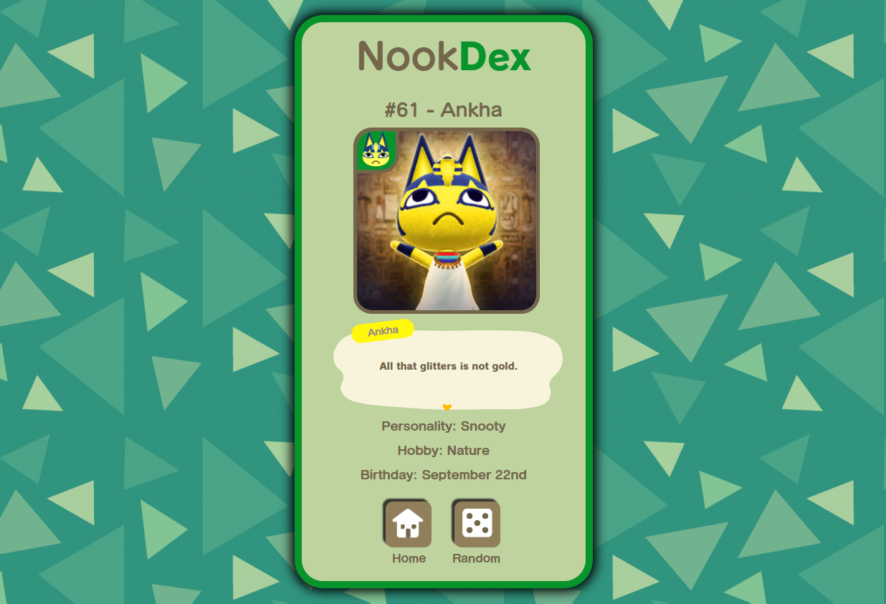

# NookDex
Application developed using ACNH API

## How to use: 
  
- Search for ACNH villagers by ID (1 - 391) or name. Just type the ID or name of the villager you want to search and press enter or click the 'search' button;
- Find random villagers by clicking the 'randomize' button;

  
  

## Disclaimer:

NookDex is a fan made website and claims no ownership of any intellectual property associated with Nintendo or Animal Crossing. All assets found on the site and the repository are the sole property of Nintendo and are only used for non-commercial and educational purpose.

API used in this project: http://acnhapi.com
